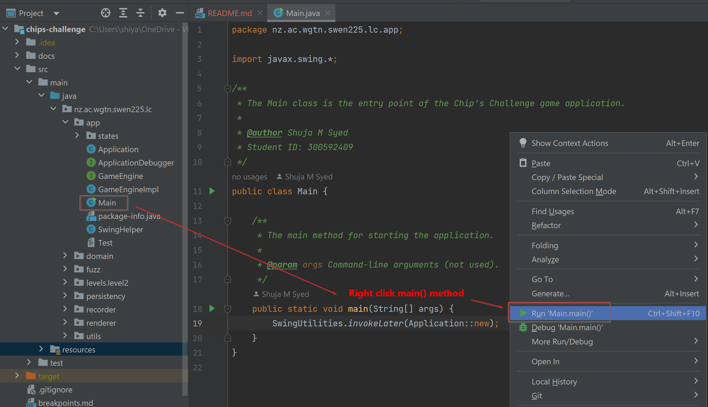
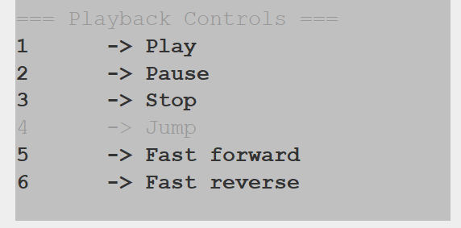
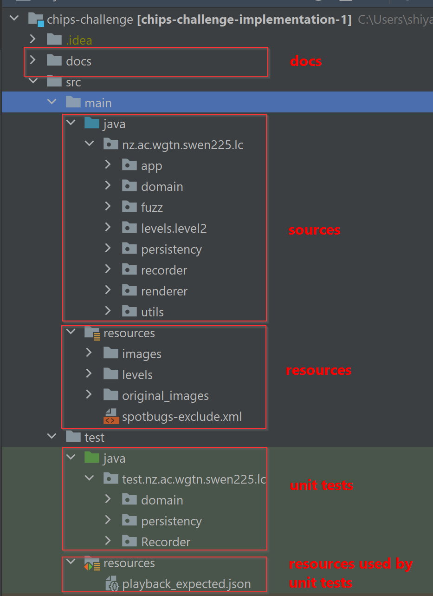
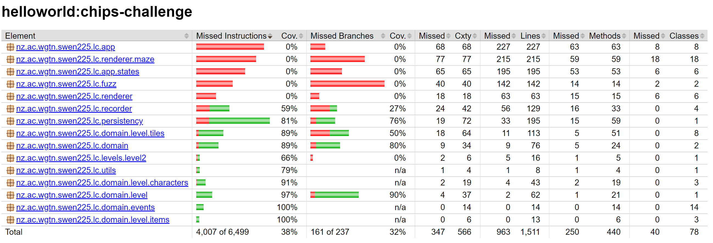

# chips-challenge

## How to play

Start the application from nz.ac.wgtn.swen225.lc.app.Main.main(String[] args) method.

Use below controls to control gameplay:

_Gameplay controls_

**Replay**

The application auto saves playbacks under target/classes:

Press Ctrl+P to load a playback. Use below controls to control replay:

_Replay controls_

## Directory Structure

## High level design

See [High level design](docs/README.md).

## Test coverage

