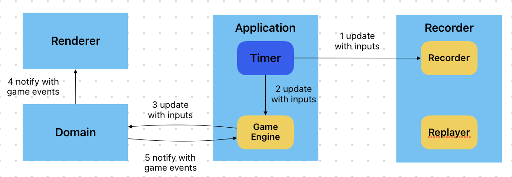
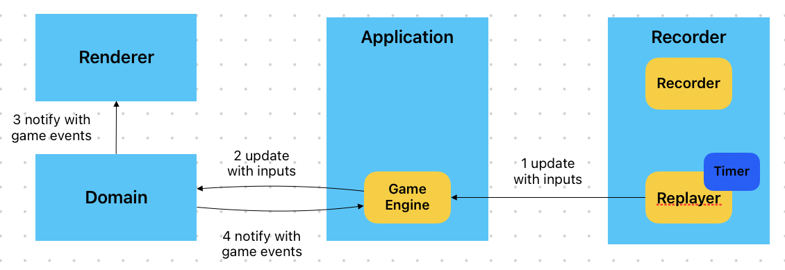
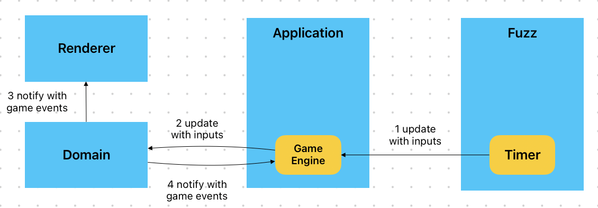

# chips-challenge

## High level design

The project uses MVC (Model-View-Controller) pattern, where Domain is model, Renderer is view and Application is
controller. Communication from domain (model) to renderer (view)/application (controller) is through Observer
pattern, where domain is observable and renderer (view)/application (controller) are observers.

The project uses java.awt.Timer to trigger ticks. In each tick, domain (model) get updated (with/without player/enemy
inputs), and it notifies renderer (view)/application (controller) about its internal state changes through various game
events. There are different timers, sitting in different modules and used to
drive different workflows: gameplay, replay and fuzz testing.

Put it together, here is how the system works under different workflows:

Gameplay



Replay



Fuzz Testing



### Domain

Domain is where most of the game models seat.

It has the following entities:

```
Entity                -> Root class for all entities in the game. 
    Game              -> Presents a game. Contains methods to update the game's interal state and notify other module 
                         about those state changes.  
    Level             -> Presents a level (or maze/board). Contains what's on the board: tiles (excluding free tiles), 
                         enemies, player, etc  
    Tile              -> Parent class for all tiles
        KeyTile       -> Presents a key tile
        ChipTile      -> Presents a chip tile
        DoorTile      -> Presents a door tile
        ... 
    Character         -> Parent class for Player and Enemy
        Player        -> Presents a player
        Enemy         -> Presents an enemy
    Key               -> Presents a key, which is used by KeyTile and Player
    Chip              -> Presents a chip, which is used by ChipTile and Player
```

Among them:

```
Tile:
    boolean isEnterable(Player player)  -> Decides whether player can enter this tile
    void onEnter(Player player)         -> Called when player enter the tile. Different tile has different behavour. 
                                           KeyTile.onEnter(Player) add the key to player's inventory, remove itself from
                                           the level (board), and fire a ChipConsumedEvent
    void onExit(Player player)          -> Called when player exit the tile
```

Domain fires follow game events:

```
GameEvent                   -> Parent class for all events
    -- level (board) changed events --
    PlayerMovedEvent        -> Fires when position of the player changed
    EnemyMovedEvent         -> Fires when position of an enemy changed
    KeyPickedUpEvent        -> Fires when a key is picked up by a player
    ChipsPickedUpEvent      -> Fires when a chip is picked up by a player
    DockUnlockedEvent       -> Fires when a door is unlocked
    ExitLockUnlockedEvent   -> Fires when the exit lock is unlocked
    InfoFieldPressedEvent   -> Fires when player entered a info field 
    InfoFieldReleasedEvent  -> Fires when player exited the info field
    -- game status changed events
    GameOverEvent
        PlayerWonEvent      -> Fires when player reaches the exit
        PlayerDiedEvent     -> Fires when player is caught by an enemy
        TimeoutEvent        -> Fires when countdown reaches 0
    -- timer events --
    TickEvent               -> Fires at the end of every tick
    CountDownEvent          -> Fires every second (PS: countdown decrease 1)
```

### Application

Application is responsible for implement a GameEngine (and a ApplicationDebugger for Fuzz to work):

```
GameEngine                    -> Represents a game engine. The most important methods in this interface are update(*) 
                                 methods below which update the game (domain) with provided/auto-generated inputs. These
                                 update(*) methods can be used by application itself, recorder or fuzz to "tick" the 
                                 gameplay/replay (replay is also a gameplay, it, just instead of polling user inputs, 
                                 retrieves inputs from historical records) 
    void onStart();           -> Called when gameplay is about to start
    boolean isGameOver();     -> Returns whether current game is over
    int getTickNo();          -> Returns current tick no.
    void update(Vector2D playerMovement);
                              -> Updates the game (domain) with provided player input (the only allowed input is an 
                                 one-tile-movement, i.e. one of Vector2D.LEFT, Vector2D.UP, Vector2D.RIGHT, 
                                 Vector2D.DOWN) and auto enemies inputs (Game engine needs to poll each enemy for input 
                                 via enemy.nextInput)
    void update(Vector2D playerMovement, Map<Enemy, Vector2D> enemyMovement);
                              -> Updates the game (domain) with provided player and enemy inputs
    void onDestroy();         -> Called after gameplay is ended
    void bindInputWithAction(KeyStroke keyStroke, Consumer<ActionEvent> callback);
                              -> Binds provided keystore with provided callback. When replaying, recorder needs to use 
                                 this methods to register its controls.  
    void unbindInputWithAction(KeyStroke keyStroke);
                              -> Unbinds provided keystore.
    Container getGlassPane(); -> Returns the glass pane. The game engine should layer a transparent (glass) pane on top 
                                 of the game window. This pane can be helpful in many cases, e.g. when game is paused, 
                                 grey out the game window and display "Paused".     

ApplicationDebugger           -> Application itself should implement this interface. During testing, Fuzz will create
                                 the application using application's constructor and then starts a new game in debug 
                                 mode.
    GameEngine newGameInDebugMode(int levelNo);
                              -> Starts a new game at provided level in debug mode. In debug mode, application does not
                                 schedule game updates, i.e. does not "tick". 
```

It is also responsible for putting the system together:

E.g. During a gameplay:

* Create an instance of Persistence class (from persistence module)
* Use above object's newGame(\*)/loadGame(\*) to create a Game (from domain module) object
* Create GameWindow class (from renderer module) object and Recorder class (from recorder module) as needed, and set up 
  their members properly: Renderer needs Game as a member, Recorder needs Game and Persistence object as members
* Holds a java.awt.Timer for scheduling game updates (ticks): In each tick, collect player and enemy inputs and feed 
  Game with those inputs via Game.update(*)
* ...

Have a look of the interfaces provided by other modules. They should be sufficient for application to work in full.

IMPORTANT At the beginning of a gameplay/replay, Application needs to give Recorder object and GameWindow object created above a
chance to prepare themselves for the show by calling:

* Recorder.onStart()
* GameWindow.setEnabled(true)

And at the end, allow them to clean up themselves by calling:

* Recorder.onDestory()
* GameWindow.setEnabled(false)

### Renderer

Renderer is responsible to render the game window. (PS: Application will render the outer application UI.)

It needs to:

* Extends java.awt.Component so that application can attach it to the main JFrame instance.
* Overwrite java.awt.Component.setEnabled(boolean) and subscribe/unsubscribe game events in that method.
    * A reference to current Game instance will be provided through constructor.
    * IMPORTANT Do not subscribe game events in the constructor immediately. Do it in setEnabled(boolean). Application
      will call later when time fits.
* Use the game events received to decide when to repaint itself by itself.

### Recorder

Recorder is responsible for:

* Record player and enemies inputs.
* Drive a replay process using an interface of Application. PS: Refer to replay workflow on the top of the page.

Here are the models it may need:

```
Playback
    Game since                            -> A snapshot of Game object when recording starts.
    List<Moment> moments                  -> A list of Moment (see below) that occured during the gameplay.
    int endTickNo                         -> The tick no when recording stops. When replaying, record ends the replay 
                                             when reaching this.
Moment                                    -> Represents a tick when there is either a player input or an enemy input
    int tickNo                            -> The tick when the input(s) happened
    Vector2D playerMovement               -> Player's input (the only allowed input is an one-tile-movement, one of 
                                             Vector2D.LEFT, Vector2D.UP, Vector2D.RIGHT, Vector2D.DOWN)
    Map<Enemy, Vector2D> enemyMovementMap -> Each enemies' input (the only allowed input is an one-tile-movement, one of
                                             Vector2D.LEFT, Vector2D.UP, Vector2D.RIGHT, Vector2D.DOWN)
```

Recorder needs to implement below two interfaces:

```
Recorder                  -> Represents a recorder which record player/enemy inputs. The current game instance will be
                             passed by application in constructor.
    void onStart()        -> Called by application when a gameplay is about to start. 
    void update(Vector2D playerMovement, Map<Enemy, Vector2D> enemyMovementMap)
                          -> Called by application in every tick.
    void onDestroy()      -> Called by application after gameplay is ended. In this method Recorder needs to persist the 
                             Playback object. Recorder needs to decide by itself where (under which folder and with
                             what filename) to store the playback. 
Replayer                  -> Represents a replayer which drives the replaying process. A GameEngine instance will be 
                             passed by application in constructor. Replayer can then use this GameEngine instance to 
                             manuplate the game.
    void onStart();       -> Called by application when a replay is about to start. Relayer should take control from here onwards.
    void onDestroy();     -> Called by application when the replay needs to exit. (E.g when application receives a new
                             game request from user.) 
```

### Persistence

Persistence is responsible for serialize java objects into json texts and saving them in disk. And vise visa. Note when
deserialize java objects from json texts, the relationship between objects should also be recovered. E.g. a Game
object can have a Level object as a member. This relationship needs also persisted and recovered.

It needs to implement below interface:

```
interface Persistence:
    List<Integer> loadAllLevelNos()                 - Returns all available level nos in a list
    Game loadGame(int levelNo)                      - Creates/compose a new Game object at provided level, return it
    Game loadGame(File save)                        - Load a previous saved Game object (in json format), deserialize it
                                                      back to a Game object, and return the latter  
    void saveGame(File save, Game game)             - Serialize the Game object into a json text and save the text to 
                                                      disk
    Playback loadPlayback(File save)                - Load a previous saved Playback object (in json format), 
                                                      deserialize it back to a Playback object, and return the latter
    void savePlayback(File save, Playback playback) - Serialize the Playback object into a json text and save the text
                                                      to disk
```

### Fuzz

There are two interfaces provided in Application for Fuzz to work. At the start, fuzz needs to create an application
using its constructor. The application will implement ApplicationDebugger from which fuzz can start a new game at a
provided level in debug mode (In debug mode, application does not schedule game updates, i.e. does not "tick") using
ApplicationDebugger.newGameInDebugMode(int levelNo). Fuzz then can use the returned GameEngine object to control the
game. (Have a look of the specification of GameEngine interface above in Application to see what's available. )


